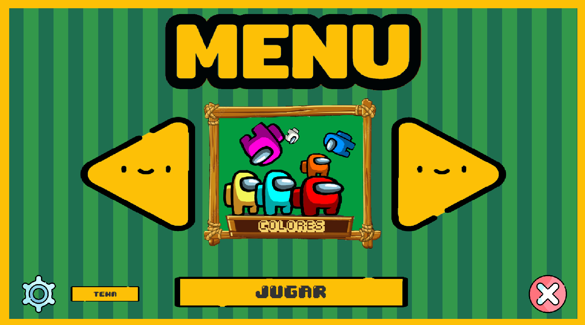
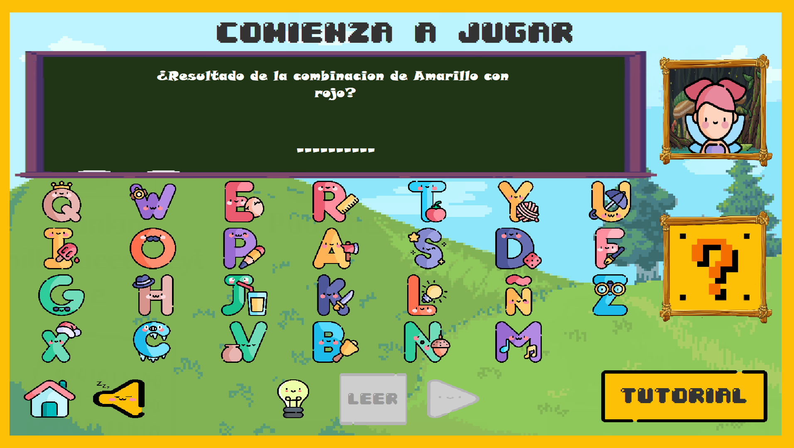
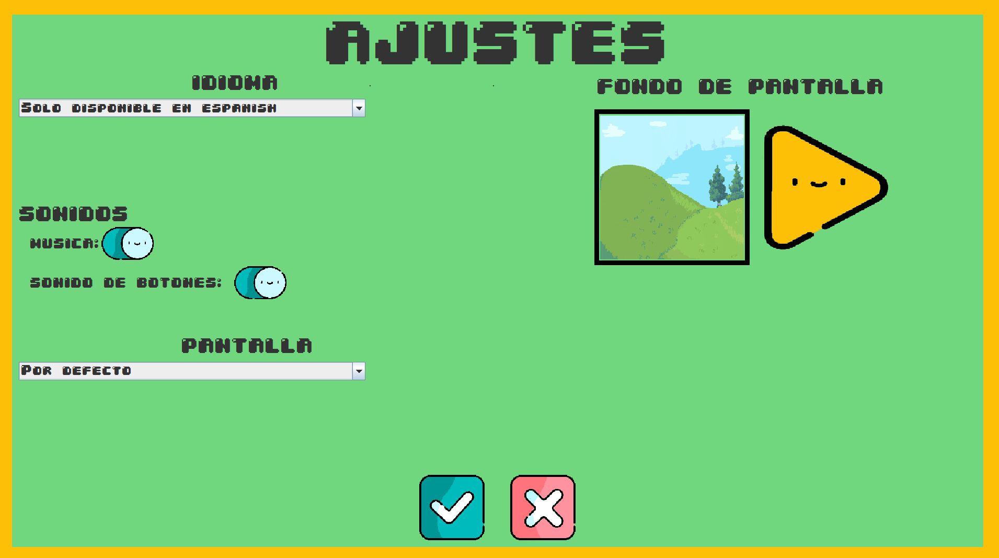
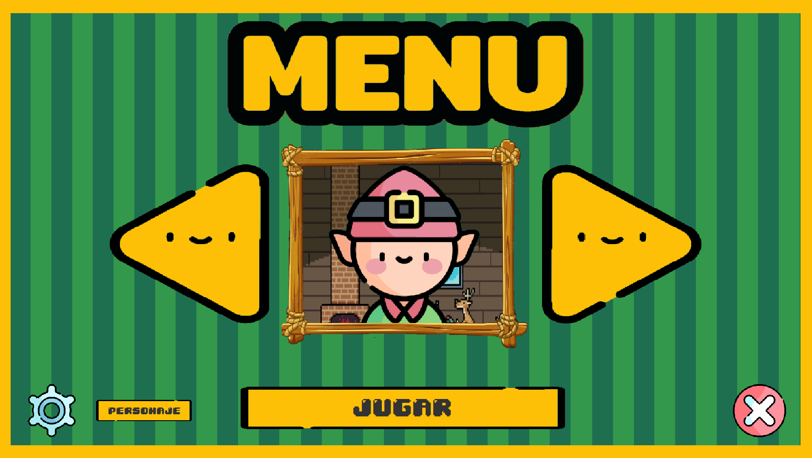

# 🎮 Proyecto ABCD Game


## 📋 Descripción

**ABCD Game** es un juego educativo interactivo desarrollado en Java con Swing, diseñado para ayudar a los niños a aprender palabras mediante un sistema de adivinanzas visuales y auditivas. El juego presenta diferentes categorías de palabras (Colores, Habitaciones, Países) y permite a los usuarios seleccionar entre dos personajes guía (Duende o Hada) para una experiencia personalizada.

## ✨ Características Principales

- 🎯 **Sistema de Palabras Interactivo**: Adivina palabras completando letras
- 🎨 **Múltiples Categorías**: Colores, Habitaciones y Países
- 👾 **Personajes Guía**: Duende y Hada con audio personalizado
- 🎵 **Sistema de Audio**: Música de fondo y efectos de sonido configurables
- 🖼️ **Fondos Personalizables**: 12 fondos diferentes para personalizar la experiencia
- ⚙️ **Configuración Completa**: Ajustes de audio, idioma y pantalla
- 💾 **Persistencia de Datos**: Base de datos SQLite para almacenar palabras y configuración

## 🏗️ Arquitectura del Proyecto

El proyecto sigue una **Arquitectura MVC (Modelo-Vista-Controlador)** con separación clara de responsabilidades y principios SOLID.

### Estructura de Capas

```
┌─────────────────────────────────────────┐
│           CAPA DE PRESENTACIÓN          │
│         (Vistas - Swing UI)             │
│  - Ventana_principal                    │
│  - Ventana_juego                        │
│  - Ventana_menu                         │
│  - Ventana_ajustes                      │
│  - Ventana_iniciar                      │
└─────────────────────────────────────────┘
                    ↕
┌─────────────────────────────────────────┐
│          CAPA DE CONTROL                │
│         (Controladores)                 │
│  - Funcionalidad (Orquestador)          │
│  - JuegoController                      │
│  - MenuController                       │
│  - AjustesController                    │
│  - VistaController                      │
│  - AudioController                      │
│  - Commands (Command Pattern)           │
└─────────────────────────────────────────┘
                    ↕
┌─────────────────────────────────────────┐
│         CAPA DE SERVICIOS               │
│      (Lógica de Negocio)                │
│  - JuegoService                         │
│  - PalabraService                       │
│  - AudioService                         │
│  - ConfiguracionService                 │
│  - ResourceLoader                       │
└─────────────────────────────────────────┘
                    ↕
┌─────────────────────────────────────────┐
│          CAPA DE MODELO                 │
│      (Datos y Entidades)                │
│  - Entities (Objeto, Personaje)         │
│  - Models (JuegoModel, Configuracion)   │
│  - Repository (Patrón Repository)       │
│  - Database (DatabaseManager)           │
└─────────────────────────────────────────┘
```

## 🎨 Patrones de Diseño Implementados

El proyecto implementa múltiples patrones de diseño para garantizar código limpio, mantenible y extensible.

### 1. 🏭 Patrón Builder

**Propósito**: Construir objetos complejos paso a paso, permitiendo diferentes representaciones del mismo objeto.

**Implementación**:
- `Tipo_Objeto` (Builder Abstracto)
- `Colores`, `Habitaciones`, `Paises` (Builders Concretos)
- `DirectorObjetos` (Director)

**Ubicación**: `src/Modelo/Builder/`

**Ejemplo de Uso**:
```java
DirectorObjetos director = new DirectorObjetos();
Tipo_Objeto builder = new Colores();
director.setObjeto(builder);
director.NuevoObjeto();
Objeto objeto = director.getObjeto();
```

**Ventajas**:
- Separación de la construcción de un objeto complejo de su representación
- Permite construir objetos paso a paso
- Facilita la adición de nuevas categorías sin modificar código existente

---

### 2. 👁️ Patrón Observer

**Propósito**: Definir una dependencia uno-a-muchos entre objetos, de manera que cuando un objeto cambia de estado, todos sus dependientes son notificados automáticamente.

**Implementación**:
- `Sujeto_Palabra` (Interfaz Sujeto)
- `Palabra` (Sujeto Concreto)
- `Observador` (Interfaz Observador)
- `ObservadorDepalabras` (Observador Concreto)

**Ubicación**: `src/Modelo/Observer/`

**Flujo**:
```
Palabra (Sujeto) → Cambio de Estado → notificar() → ObservadorDepalabras.actualizar()
```

**Ventajas**:
- Desacoplamiento entre el sujeto y los observadores
- Permite agregar nuevos observadores sin modificar el sujeto
- Notificación automática de cambios de estado

---

### 3. 🔒 Patrón Singleton

**Propósito**: Garantizar que una clase tenga una única instancia y proporcionar un punto de acceso global a ella.

**Implementación**:
- `Singleton_ajustes`: Gestión de fondos de pantalla
- `DatabaseManager`: Gestión de conexiones a base de datos

**Ubicación**: `src/Modelo/Singleton/`, `src/Modelo/Database/`

**Características**:
- Thread-safe con double-check locking
- Inicialización lazy
- Pool de conexiones para DatabaseManager

**Ejemplo**:
```java
Singleton_ajustes ajustes = Singleton_ajustes.getInstance();
URL fondo = ajustes.obtenerSiguienteFondo();
```

---

### 4. 🎯 Patrón Strategy

**Propósito**: Definir una familia de algoritmos, encapsularlos y hacerlos intercambiables.

**Implementación**:
- `CategoriaStrategy` (Interfaz Strategy)
- `ColoresStrategy`, `HabitacionesStrategy`, `PaisesStrategy` (Estrategias Concretas)
- `DuendeStrategy`, `HadaStrategy`, `PersonajeStrategy` (Estrategias de Personajes)

**Ubicación**: `src/Estrategias/`

**Ventajas**:
- Permite cambiar algoritmos en tiempo de ejecución
- Elimina condicionales múltiples
- Facilita la extensión con nuevas estrategias

---

### 5. 📝 Patrón Command

**Propósito**: Encapsular una solicitud como un objeto, permitiendo parametrizar clientes con diferentes solicitudes, encolar operaciones y soportar operaciones deshacer.

**Implementación**:
- `Command` (Interfaz Command)
- `JugarCommand`, `SeleccionarLetraCommand`, `SiguientePalabraCommand`, etc. (Comandos Concretos)
- `CommandFactory` (Factory para crear comandos)

**Ubicación**: `src/Controlador/Commands/`

**Comandos Disponibles**:
- `JugarCommand`: Inicia el juego
- `SeleccionarLetraCommand`: Selecciona una letra
- `SiguientePalabraCommand`: Avanza a la siguiente palabra
- `AyudaCommand`: Muestra ayuda
- `MostrarMenuCommand`: Muestra el menú
- `MostrarAjustesCommand`: Muestra ajustes
- `SalirCommand`: Sale del juego

**Ventajas**:
- Desacopla el objeto que invoca la operación del objeto que la ejecuta
- Permite encolar, registrar y deshacer operaciones
- Facilita la implementación de macros

---

### 6. 🏭 Patrón Factory

**Propósito**: Proporcionar una interfaz para crear objetos sin especificar sus clases exactas.

**Implementación**:
- `CommandFactory`: Crea comandos de manera centralizada

**Ubicación**: `src/Controlador/Commands/CommandFactory.java`

**Ventajas**:
- Centraliza la creación de objetos
- Facilita la reutilización de comandos
- Reduce el acoplamiento

---

### 7. 📦 Patrón Repository

**Propósito**: Abstraer la lógica de acceso a datos, proporcionando una interfaz más orientada a objetos.

**Implementación**:
- `PalabraRepository`: Acceso a palabras desde la base de datos
- `PersonajeRepository`: Acceso a personajes desde la base de datos

**Ubicación**: `src/Modelo/Repository/`

**Ventajas**:
- Separa la lógica de acceso a datos de la lógica de negocio
- Facilita el testing con mocks
- Proporciona una interfaz consistente para acceso a datos

---

## 📁 Estructura del Proyecto

```
ABCDgame/
├── src/
│   ├── Controlador/              # Capa de Control
│   │   ├── Commands/             # Patrón Command
│   │   │   ├── Command.java
│   │   │   ├── CommandFactory.java
│   │   │   ├── JugarCommand.java
│   │   │   └── ...
│   │   ├── JuegoController.java
│   │   ├── MenuController.java
│   │   ├── AjustesController.java
│   │   ├── VistaController.java
│   │   ├── AudioController.java
│   │   └── Funcionalidad.java   # Orquestador principal
│   │
│   ├── Vistas/                   # Capa de Presentación
│   │   ├── Ventana_principal.java
│   │   ├── Ventana_juego.java
│   │   ├── Ventana_menu.java
│   │   ├── Ventana_ajustes.java
│   │   └── Ventana_iniciar.java
│   │
│   ├── Modelo/                   # Capa de Modelo
│   │   ├── Builder/              # Patrón Builder
│   │   │   ├── Tipo_Objeto.java
│   │   │   ├── DirectorObjetos.java
│   │   │   ├── Colores.java
│   │   │   ├── Habitaciones.java
│   │   │   └── Paises.java
│   │   ├── Observer/             # Patrón Observer
│   │   │   ├── Sujeto_Palabra.java
│   │   │   ├── Observador.java
│   │   │   ├── Palabra.java
│   │   │   └── ObservadorDepalabras.java
│   │   ├── Singleton/            # Patrón Singleton
│   │   │   └── Singleton_ajustes.java
│   │   ├── Repository/          # Patrón Repository
│   │   │   ├── PalabraRepository.java
│   │   │   └── PersonajeRepository.java
│   │   ├── Database/             # Gestión de Base de Datos
│   │   │   └── DatabaseManager.java
│   │   ├── Entities/             # Entidades
│   │   │   ├── Objeto.java
│   │   │   └── Personaje.java
│   │   └── Models/               # Modelos de Datos
│   │       ├── JuegoModel.java
│   │       └── ConfiguracionModel.java
│   │
│   ├── Servicios/                # Capa de Servicios
│   │   ├── JuegoService.java
│   │   ├── PalabraService.java
│   │   ├── AudioService.java
│   │   ├── ConfiguracionService.java
│   │   └── ResourceLoader.java
│   │
│   ├── Estrategias/              # Patrón Strategy
│   │   ├── CategoriaStrategy.java
│   │   ├── ColoresStrategy.java
│   │   ├── HabitacionesStrategy.java
│   │   ├── PaisesStrategy.java
│   │   ├── DuendeStrategy.java
│   │   ├── HadaStrategy.java
│   │   └── PersonajeStrategy.java
│   │
│   ├── Utilidades/               # Utilidades y Constantes
│   │   ├── GameConstants.java
│   │   ├── ButtonAnimationManager.java
│   │   └── Font_letras.java
│   │
│   └── recursos/                 # Recursos del Juego
│       ├── imagenes/
│       ├── audios/
│       ├── fuentes/
│       └── videos/
│
├── resource-readme/              # Imágenes para README
│   ├── loading.png
│   ├── vista_juego.png
│   ├── vista_menu.png
│   ├── vista_ajustes.png
│   └── vista_pj.png
│
├── build.xml                    # Script de construcción
├── manifest.mf                 # Manifest del JAR
└── README.md                   # Este archivo
```

## 🖼️ Capturas de Pantalla

### Pantalla de Menú Principal


La pantalla de menú permite seleccionar la categoría de palabras (Colores, Habitaciones, Países) y el personaje guía (Duende o Hada).

### Pantalla de Juego


Interfaz principal del juego donde el usuario adivina palabras completando letras. Incluye:
- Pizarra con la pregunta/descripción
- Teclado virtual con letras del alfabeto
- Personaje guía seleccionado
- Botones de ayuda y navegación

### Pantalla de Ajustes


Configuración del juego incluyendo:
- Idioma (actualmente solo español)
- Sonidos (música y efectos)
- Fondo de pantalla (12 opciones)
- Configuración de pantalla

### Selección de Personaje


Pantalla para seleccionar el personaje guía que acompañará al usuario durante el juego.

## 🛠️ Tecnologías Utilizadas

- **Java**: Lenguaje de programación principal
- **Java Swing**: Framework para la interfaz gráfica
- **SQLite**: Base de datos para persistencia
- **SQLite JDBC**: Driver para conexión a SQLite
- **Java Sound API**: Reproducción de audio
- **NetBeans**: IDE de desarrollo (opcional)

## 📦 Dependencias

- `sqlite-jdbc-3.51.1.0.jar`: Driver JDBC para SQLite
- `AbsoluteLayout.jar`: Layout manager para Swing

## 🚀 Instalación y Ejecución

### Requisitos Previos

- Java JDK 8 o superior
- Sistema operativo: Windows, Linux o macOS

### Pasos de Instalación

1. **Clonar o descargar el proyecto**
   ```bash
   git clone <repository-url>
   cd ABCDgame
   ```

2. **Compilar el proyecto**
   ```bash
   # Usando NetBeans
   # Abrir el proyecto en NetBeans y hacer clic en "Build Project"
   
   # O usando Ant (si está configurado)
   ant build
   ```

3. **Ejecutar el juego**
   ```bash
   # Desde la carpeta dist
   cd dist
   java -jar Proyecto_ABCD.jar
   ```

   O ejecutar directamente desde el IDE:
   - Clase principal: `Vistas.Iniciar`
   - Método: `main(String[] args)`

### Configuración de Base de Datos

La base de datos SQLite se crea automáticamente al ejecutar el juego por primera vez. El archivo `abcdgame.db` se genera en el directorio raíz del proyecto.

## 🎮 Uso del Juego

1. **Inicio**: Al ejecutar el juego, se muestra la pantalla de inicio
2. **Menú**: Selecciona una categoría (Colores, Habitaciones, Países) y un personaje (Duende o Hada)
3. **Juego**: 
   - Lee la descripción en la pizarra
   - Haz clic en las letras del teclado virtual para completar la palabra
   - Usa el botón de ayuda (?) si necesitas una pista
   - Usa el botón "Siguiente" para pasar a la siguiente palabra
4. **Ajustes**: Accede a la configuración desde el menú para personalizar audio, fondos y pantalla

## 🏛️ Principios SOLID Aplicados

### Single Responsibility Principle (SRP)
- Cada clase tiene una única responsabilidad
- `JuegoController`: Controla la lógica del juego
- `AudioController`: Gestiona el audio
- `VistaController`: Gestiona las vistas

### Open/Closed Principle (OCP)
- El patrón Strategy permite agregar nuevas categorías sin modificar código existente
- El patrón Builder facilita la extensión con nuevos tipos de objetos

### Liskov Substitution Principle (LSP)
- Las implementaciones de `CategoriaStrategy` son intercambiables
- Los comandos implementan la interfaz `Command` de manera consistente

### Interface Segregation Principle (ISP)
- Interfaces específicas como `Sujeto_Palabra` y `Observador`
- `Command` con métodos opcionales para deshacer

### Dependency Inversion Principle (DIP)
- Los controladores dependen de abstracciones (servicios, interfaces)
- Uso de inyección de dependencias en constructores

## 🔧 Mejores Prácticas Implementadas

- ✅ **Código Limpio**: Nombres descriptivos, métodos pequeños, responsabilidades claras
- ✅ **Separación de Concerns**: MVC bien definido
- ✅ **Manejo de Errores**: Logging y manejo de excepciones
- ✅ **Constantes Centralizadas**: `GameConstants` para valores mágicos
- ✅ **Documentación**: Comentarios Javadoc en clases principales
- ✅ **Pool de Conexiones**: Gestión eficiente de conexiones a BD
- ✅ **Thread Safety**: Singleton thread-safe con double-check locking

## 📊 Diagrama de Flujo del Juego

```
[Inicio] → [Menú Principal] → [Selección Categoría/Personaje]
    ↓
[Juego] → [Adivinar Palabra] → [¿Completa?]
    ↓                              ↓
[Pista] ← [Ayuda]              [Siguiente Palabra]
    ↓                              ↓
[Configuración] ← [Ajustes]    [Fin de Categoría]
    ↓                              ↓
[Salir]                        [Volver al Menú]
```

## 🔄 Flujo de Datos

```
Vista → Controlador → Servicio → Repository → Database
  ↑                                              ↓
  └────────────── Observer ← Modelo ←───────────┘
```

## 🎯 Extensibilidad

El proyecto está diseñado para ser fácilmente extensible:

1. **Nuevas Categorías**: Implementar `CategoriaStrategy` y crear un nuevo Builder
2. **Nuevos Personajes**: Agregar a la base de datos y crear estrategia correspondiente
3. **Nuevos Comandos**: Implementar la interfaz `Command` y agregar al `CommandFactory`
4. **Nuevas Vistas**: Extender `Ventana_principal` con CardLayout

## 📝 Notas de Desarrollo

- El proyecto utiliza **NetBeans** como IDE principal
- La base de datos se inicializa automáticamente al ejecutar
- Los recursos (imágenes, audio) están en `src/recursos/`
- El JAR ejecutable se genera en `dist/Proyecto_ABCD.jar`

## 🤝 Contribuciones

Este proyecto está diseñado como ejemplo educativo de arquitectura de software y patrones de diseño. Las contribuciones son bienvenidas para mejorar la documentación, agregar nuevas características o corregir errores.

## 📄 Licencia

Este proyecto es de uso educativo y demostrativo.

## 👨‍💻 Autor

Desarrollado como proyecto educativo demostrando arquitectura de software limpia y patrones de diseño.

---

**¡Disfruta aprendiendo con ABCD Game!** 🎮✨
